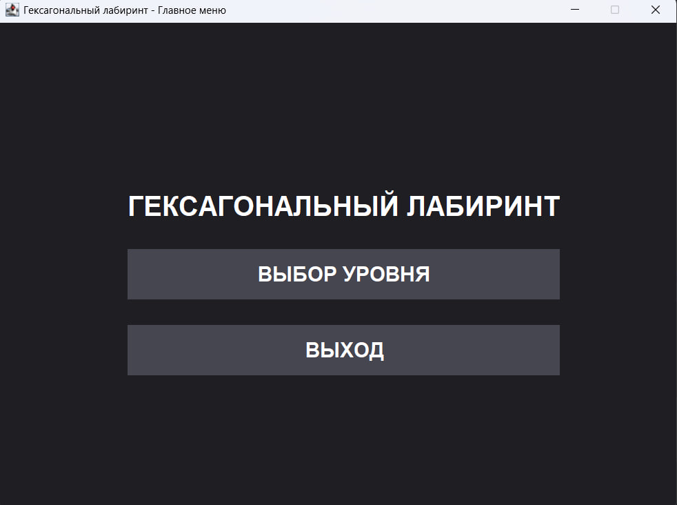
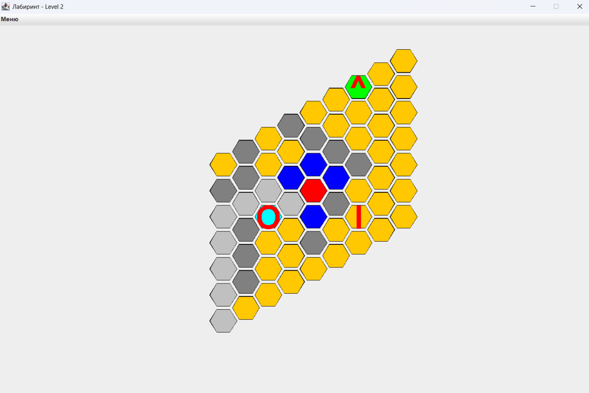
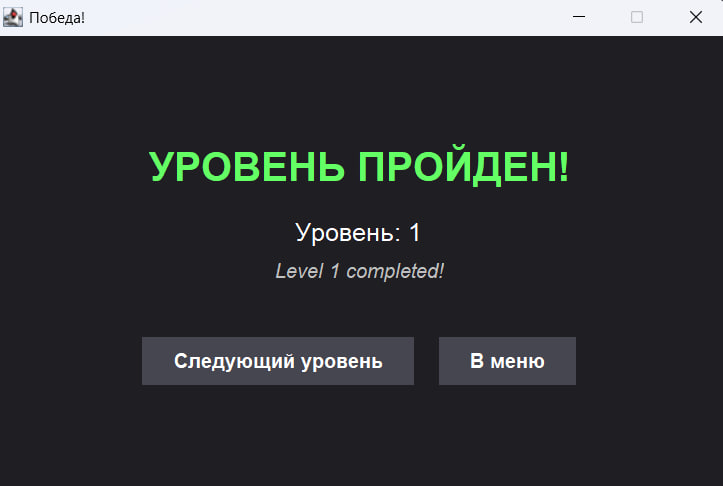

# Игра "Cells_JavaGame"

Java-игра-головоломка, где игрок перемещается по шестиугольной сетке, оставляя цветные следы и собирая ключи для достижения выхода.

## 🎮 Правила игры
- **Перемещение**: По соседним шестиугольникам 
- **Следы**: Каждый ход оставляет цветной след (нельзя повторно посещать)
- **Цели**:
  - Собрать все ключи перед достижением выхода
  - Клетка выхода может посещаться многократно (не оставляет следа)
- **Особые клетки**:
  - 🔴 Красная - Позиция игрока
  - 🔵 Синие - Доступные для хода клетки
  - 🟢 Зеленая - Выход
  - 🟠 Оранжевые - Обычные клетки
  - ⚪ Серые - Стены (непроходимы)
  - 🔷 Голубые - Телепорты (меняются местами при наступлении)

## 🛠️ Техническая реализация
- **Язык**: Java SE 22
- **Интерфейс**: Swing с кастомными шестиугольными кнопками
- **Архитектура**: MVC с разделением логики и представления

### Ключевые классы
| Класс | Назначение |
|-------|------------|
| `LevelModel` | Управление состоянием игры и логикой поля |
| `LevelView` | Визуальное отображение и интерфейс |
| `Player` | Отслеживание позиции и собранных ключей |
| `AbstractCell` | Базовый класс для всех типов клеток |
| `ExitCell` | Клетка выхода с условием победы |
| `TeleportCell` | Подвижная клетка, меняющая позиции |

## 🖼️ Скриншоты
  
*Интерфейс главного меню*

  
*Игровое поле с игроком (красный), ключами ("l") и доступными ходами (синие)*

  
*Экран победы*

## 🧪 Тестирование
Полное тестовое покрытие для:
- Механики перемещения игрока
- Системы сбора ключей
- Управления состоянием клеток
- Взаимодействия с особыми клетками (телепорты и выход)

### Для большей информации по игре советую ознакомиться с документом курсовой работы, составленной в рамках разработки этого проекта!
